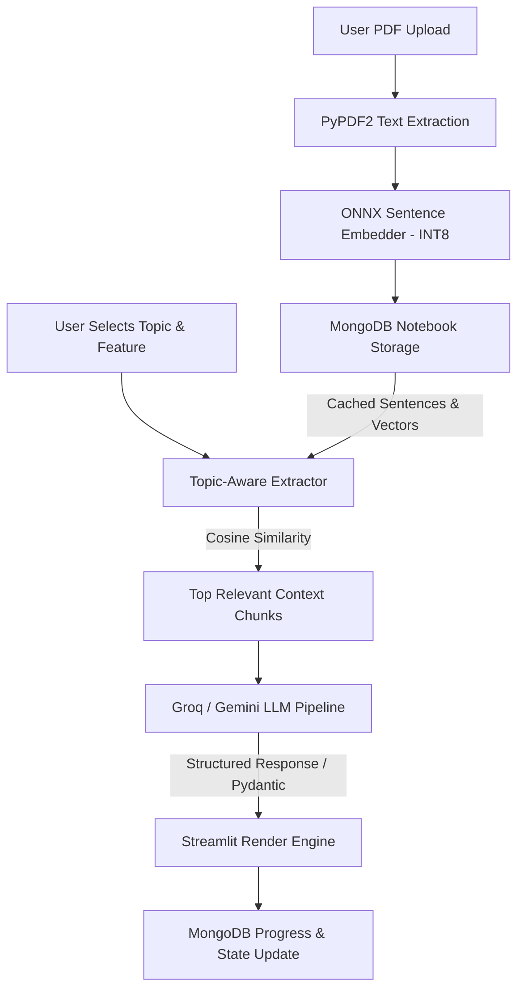

# Technical Specification: Mind Palace Study Tool

This document serves as the comprehensive internal technical specification for the **Mind Palace Study Tool** (`mind-palace-study-tool`). It details the system architecture, design decisions, data models, module interfaces, and operational workflows to enable engineering teams and future AI agents to maintain and extend the codebase.

---

# Overview

## Resume Focus Areas
- **Full-Stack AI Application Engineering**: Streamlit multi-page UI combined with asynchronous backend services and external LLM/Embedding pipelines.
- **On-Device Edge ML & Quantization**: Inference acceleration using INT8-quantized ONNX models (`nomic-embed-text-v1.5`) via `onnxruntime` to execute zero-cost, privacy-preserving semantic search without server-side GPUs or PyTorch overhead.
- **Single-Document NoSQL Data Modeling**: Optimized MongoDB schemas aggregating study materials, progression states, vector caches, and interactive tools under single-document boundaries.
- **Context-Aware RAG (Retrieval-Augmented Generation)**: Dynamic document chunking, prefix-aware query embedding, and heuristic keyword fallback strategies for LLM prompt context optimization.

## Purpose
Mind Palace is an interactive, AI-powered study workspace that converts unstructured PDF documents (textbooks, lecture notes, slide decks) into structured learning assets including summaries, flashcards, adaptive quizzes, study schedules, mnemonics, and an AI-based Socratic tutor.

## Problem Solved
Reading multi-page academic PDFs leads to passive consumption and poor knowledge retention. Traditional AI summarizers treat documents as monolithic text blobs, exceeding context limits and incurring high token costs. Mind Palace provides:
1. Topic-scoped retrieval so LLMs process only relevant document sub-sections.
2. Active recall tools (flashcards, structured quizzes, mnemonics) generated automatically from specific topics.
3. Gamified progression tracking (study streaks, completion scores, mastery metrics).

## Target Users
- **Students & Researchers**: Preparing for exams or reviewing dense academic papers.
- **Self-Directed Learners**: Converting unstructured notes into structured daily study schedules.

## Core Features
1. **PDF Ingestion & Text Extraction**: PyPDF2 text extraction with Base64 document encoding.
2. **Topic-Aware Extraction (Local ONNX Vector RAG)**: On-device sentence embedding (`nomic-embed-text-v1.5`) to calculate cosine similarity between sub-topics and document sentences.
3. **Structured Quiz & Flashcard Generators**: LLM-driven generation (via Groq API / Gemini) enforcing strict JSON schemas for automated active-recall generation.
4. **Adaptive Study Scheduler**: Breakdown of document content into daily time-boxed study tasks.
5. **Memory Aid & Mnemonic Generator**: AI generation of acronyms, rhymes, stories, or phrases anchored to extracted topics.
6. **Socratic Tutor ("Talk to Duck")**: Interactive chat interface querying context-specific document slices with dynamic feedback and scoring.
7. **Progress & Mastery Dashboard**: Persistence of quiz averages, task completion states, and study streaks.

---

# Architecture

## High-Level Architecture

Mind Palace follows a hybrid client-server model:
- **Presentation Layer**: Multi-page web application rendered via Streamlit.
- **Inference Layer (Local)**: CPU-bound vector embedding engine running quantized ONNX models via `onnxruntime` and `transformers` tokenizers.
- **Inference Layer (Remote)**: External LLM APIs (Groq SDK using fast open-weights LLMs like `llama-3.3-70b-versatile` / `gpt-oss-120b` or Gemini API) for high-reasoning tasks and structured generation.
- **Persistence Layer**: MongoDB database storing unified notebook documents containing raw text, vector embeddings, generated flashcards/quizzes, and progress state.

## System Data Flow



---

# Tech Stack

| Technology | Role | Why Chosen | Alternatives Considered | Trade-offs |
| :--- | :--- | :--- | :--- | :--- |
| **Python 3.10+** | Core Runtime | Deep ecosystem for ML runtime integration, string parsing, and web tooling. | Node.js, Go | Slower single-threaded execution for heavy loops compared to Go/Rust. |
| **Streamlit** | UI Framework | Rapid prototyping of data and AI tools with built-in session state management. | React + FastAPI, Next.js | Streamlit re-runs scripts on user interaction, requiring careful state management. |
| **ONNX Runtime (CPU)** | Local Vector Embedding | Enables INT8 quantized local model execution without requiring PyTorch/CUDA dependencies. | PyTorch, Sentence-Transformers, OpenAI API | Initial model download (~100-300MB); bounded by host CPU performance. |
| **Groq API / Open Models** | Primary LLM Provider | Ultra-low latency inference for prompt-heavy applications (Flashcards, Socratic Tutor). | OpenAI GPT-4o, Anthropic Claude | Rate limits on free tier; minor variations in structured JSON adherence. |
| **PyMongo / MongoDB** | Database | Flexible document schema; allows nesting arrays (flashcards, schedules) inside a single document. | PostgreSQL, SQLite | BSON 16MB document size limit if Base64 PDFs become overly large. |
| **PyPDF2** | PDF Parsing | Pure-Python lightweight PDF reader with zero system-level C dependencies. | pdfplumber, PyMuPDF (fitz) | Does not support OCR for scanned image PDFs. |

---

# Key Modules

## 1. Local Vector Embedder (`utils/onnx_embedder.py`)
- **Responsibility**: Loads `nomic-embed-text-v1.5` in INT8 format using `onnxruntime`. Tokenizes incoming text and generates L2-normalized sentence embeddings.
- **Inputs**: Strings or lists of strings with prefix flags (`search_document:` vs `search_query:`).
- **Outputs**: `np.ndarray` of shape `(N, 768)` containing L2-normalized floating-point vectors.
- **Dependencies**: `onnxruntime`, `transformers` (AutoTokenizer), `numpy`.
- **Extension Points**: Swap `model_int8.onnx` path to support updated embedder models without altering callers.

## 2. Topic-Aware Text Extractor (`utils/text_extraction.py`)
- **Responsibility**: Performs semantic search across document sentences using cosine similarity. Slices and joins top-ranked sentence windows to construct targeted LLM context windows (up to `max_length` limit, default 8,000 chars).
- **Inputs**: Full document string, query string (topic), optional pre-computed embedding cache dict.
- **Outputs**: Sub-string containing the most semantically relevant context chunks.
- **Dependencies**: `numpy`, `utils.onnx_embedder`.
- **Extension Points**: Keyword substring fallback activates automatically if ONNX runtime fails or model files are missing.

## 3. Database Operations Handler (`utils/db.py`)
- **Responsibility**: Manages all CRUD operations against MongoDB `notebooks` collection.
- **Inputs**: PyMongo queries, dictionary models for schedules, quizzes, flashcards, and progress tracking.
- **Outputs**: BSON document objects, list records, insert IDs.
- **Dependencies**: `pymongo`, `bson.objectid`, `python-dotenv`.
- **Extension Points**: Modular methods for updating progress sub-documents (`update_progress`) or nested arrays (`add_flashcards`, `save_quiz`).

## 4. LLM & Prompt Pipeline (`utils/helpers.py`)
- **Responsibility**: Formats system/user prompts from external files (`prompts/`), executes Groq API calls, handles JSON response parsing, and fallbacks.
- **Inputs**: Prompt filenames, string kwargs (`topic`, `text`), model identifiers.
- **Outputs**: Formatted strings or validated JSON dictionaries.
- **Dependencies**: `groq`, `json`, `re`.

---

# Database & APIs

## Database Schema (MongoDB Collection: `notebooks`)

All state associated with a document is stored within a single document:

```javascript
{
  "_id": ObjectId("..."),
  "filename": String,
  "pdf_content": String,          // Base64 encoded PDF
  "text_content": String,         // Extracted text via PyPDF2
  "summary": String,              // High-level document summary
  "topics": [String],             // Array of extracted key topics
  "embeddings": {                 // Pre-computed vector cache
    "sentences": [String],
    "embeddings": [[Float]]      // Array of 768-dim float arrays
  },
  "created_at": Date,
  "updated_at": Date,
  "schedule_days": Number,
  "hours_per_day": Float,
  "schedule_start_date": String,
  "schedule": [
    {
      "day": Number,
      "tasks": [
        { "description": String, "points": Number }
      ]
    }
  ],
  "flashcards": [
    {
      "_id": String,
      "topic": String,
      "question": String,
      "answer": String,
      "difficulty": String,       // "easy", "medium", "hard"
      "created_at": String
    }
  ],
  "quizzes": [
    {
      "_id": String,
      "topic": String,
      "questions": [
        {
          "id": Number,
          "question": String,
          "options": [String],
          "correct_answer": String,
          "explanation": String
        }
      ],
      "attempts": [
        { "score": Number, "total": Number, "date": String }
      ]
    }
  ],
  "acronyms": [
    {
      "_id": String,
      "topic": String,
      "type": String,             // "acronym", "rhyme", "story"
      "content": String,
      "explanation": String
    }
  ],
  "progress": {
    "completed_tasks": [String],  // Task IDs ("1_0", "1_1")
    "total_score": Number,
    "last_activity": Date,
    "topic_mastery": Object,      // Key-value pairs: { "Topic": MasteryPercentage }
    "quiz_average": Float,
    "study_streak": Number
  }
}
```

---

# Core Workflows

## 1. Document Ingestion & Embeddings Caching Workflow
1. User uploads a PDF file via Streamlit file uploader on `app.py`.
2. PyPDF2 reads raw bytes, extracts ASCII text into memory, and base64-encodes the raw file for viewer rendering.
3. System triggers LLM summary generation (`summary_prompt.txt`) and topic extraction (`topics_prompt.txt`).
4. `text_extraction.py` splits full document into sentences and passes them to `onnx_embedder.py`.
5. `OnnxEmbedder` prepends `"search_document:"` to each sentence, tokenizes, runs inference via ONNX Runtime CPU provider, and outputs L2-normalized float32 vectors.
6. A single BSON document containing text, base64 data, summary, topics, and sentence-level embedding vectors is written to MongoDB.

## 2. Topic-Aware Active Learning Generation (Flashcards/Quiz/Talk to Duck)
1. User selects a sub-topic from the dropdown interface on a feature page (e.g., `pages/3_🎴_Flashcards.py`).
2. System fetches the notebook document from MongoDB.
3. System checks if pre-computed sentence embeddings exist:
   - If present, `TopicAwareTextExtractor` converts cached embedding lists back into `numpy` arrays.
   - Embeds the selected topic string with prefix `"search_query:"`.
   - Computes cosine dot product matrix between topic vector and sentence vectors.
   - Extracts top 20 relevant sentences, groups context windows, and returns up to 8,000 characters.
4. Extracted context slice is injected into specific prompt templates (`flashcard_prompt.txt` or `quiz_prompt.txt`).
5. Groq LLM processes the prompt; custom regex or JSON parsers extract structured arrays and persist them into MongoDB.

---

# Important Design Decisions

## Decision 1: Single-Document Nested Schema vs. Multi-Collection Relational Schema in MongoDB
- **Problem**: Storing flashcards, schedules, progress, and quizzes in separate collections requires multiple `join` (`$lookup`) queries on every page refresh.
- **Chosen Solution**: Aggregate all sub-resources inside array fields on the parent `notebooks` document.
- **Why Chosen**: Streamlit applications reload state frequently; loading a single MongoDB document by `_id` yields all context in a single atomic database query.
- **Trade-offs**: Requires monitoring document sizes so Base64 PDF storage combined with embeddings does not exceed the BSON 16MB limit.

## Decision 2: INT8 Local ONNX Inference for RAG vs. Cloud Embedding API Calls
- **Problem**: Making cloud API calls to embed hundreds of document sentences on every upload adds latency, usage cost, and API key management overhead.
- **Chosen Solution**: Run local INT8-quantized `nomic-embed-text-v1.5` on CPU using `onnxruntime`.
- **Why Chosen**: Eliminates API costs for embeddings, guarantees offline embedding generation, and runs efficiently on standard CPU server environments without requiring a GPU.
- **Trade-offs**: Higher application memory consumption and inclusion of local model binary assets (`onnx/model_int8.onnx`).

## Decision 3: Topic-Aware Context Window Slicing vs. Monolithic Document Prompting
- **Problem**: Passing entire multi-page textbook texts to LLM prompts exceeds model token limits and degrades output precision.
- **Chosen Solution**: Dynamic top-k sentence context extraction based on topic vector similarity prior to LLM invocation.
- **Why Chosen**: Dramatically reduces input token counts per feature request and improves response accuracy.
- **Trade-offs**: Sentences separated across wide document gaps may lose global narrative coherence if the top-k window is too small.

---

# Challenges

## 1. High Latency & Dependency Bloat of Heavy ML Frameworks (PyTorch/Sentence-Transformers)
- **Challenge**: Initial prototypes utilizing PyTorch and full HuggingFace Transformers libraries caused multi-gigabyte container image sizes and long startup delays.
- **Solution**: Replaced PyTorch runtime with `onnxruntime` executing INT8-quantized model graphs (`model_int8.onnx`). Used HuggingFace `AutoTokenizer` solely for tokenization, reducing runtime resource footprints.

## 2. Inconsistent LLM JSON Formatting for Quiz Generation
- **Challenge**: LLM outputs frequently contained Markdown code blocks (````json ... ````) or trailing commas that broke standard `json.loads()`.
- **Solution**: Developed a resilient JSON extraction helper (`parse_json_response` in `helpers.py`) utilizing regular expressions (`r'```json\s*(.*?)\s*```'`) and fallback sanitization logic before parsing.

---

# Resume & Interview Notes

## Resume Bullet Points
- Designed and built **Mind Palace**, an AI study platform that converts dense academic PDFs into structured study plans, quizzes, and active recall flashcards.
- Implemented an **on-device RAG engine** using **INT8-quantized ONNX models** (`nomic-embed-text-v1.5`) and `onnxruntime`, delivering CPU-bound vector similarity search without external embedding API costs.
- Architected a **single-document NoSQL data model** in MongoDB to store document text, pre-computed vector caches, flashcards, and gamified progress tracking within atomic document boundaries.
- Built a **Socratic AI Tutor & Quiz Generator** utilizing Groq open-weight LLMs, dynamic prompt formatting, and regex-assisted JSON parsing for structured UI rendering.

## STAR Architectural Summary
- **Situation**: Dense academic PDFs are difficult to review efficiently, and passing entire documents into LLM prompts leads to high API costs, token truncation, and degraded response accuracy.
- **Task**: Build a low-latency, cost-effective study platform that intelligently slices document context by topic and automatically generates structured active-recall study tools.
- **Action**: Integrated PyPDF2 for text parsing, implemented an on-device ONNX INT8 embedding pipeline for fast semantic sentence search, designed a single-document MongoDB schema for unified state management, and built an interactive Streamlit UI powered by Groq LLMs.
- **Result**: Delivered a local RAG study application that eliminates cloud embedding costs, optimizes context windows to 8k characters per topic request, and provides real-time gamified study tracking.

## Common Interview Questions & Answers

### Q: Why did you choose ONNX Runtime instead of calling OpenAI Embeddings API or using PyTorch?
> **Answer**: Calling cloud embedding APIs adds ongoing financial cost and network latency on every PDF upload. Using standard PyTorch or `sentence-transformers` requires installing several gigabytes of GPU/CPU binaries, making deployment heavy. By using an INT8-quantized `nomic-embed-text-v1.5` ONNX model executed via `onnxruntime`, the app achieves low-latency local embeddings on standard CPUs with zero external API dependency and minimal container footprint.

### Q: How do you handle potential BSON 16MB document size limits in MongoDB given that you store Base64 PDFs and embeddings in the same document?
> **Answer**: In the current architecture, all fields reside in a single document for atomic fast retrieval in Streamlit. However, to handle large multi-megabyte PDFs in production, the recommended evolution is to store raw PDF files in an AWS S3 bucket, saving only the S3 URL in MongoDB while keeping the extracted text, vector cache, and metadata in the database document.

### Q: How does the system handle cases where vector embedding fails or the model file is unavailable?
> **Answer**: The system implements a explicit fallback mechanism in `text_extraction.py`. If `onnxruntime` or embedding dependencies fail to load, `EMBEDDINGS_AVAILABLE` evaluates to `False`. The `TopicAwareTextExtractor` automatically falls back to keyword window matching around the requested topic string to ensure uninterrupted service.
